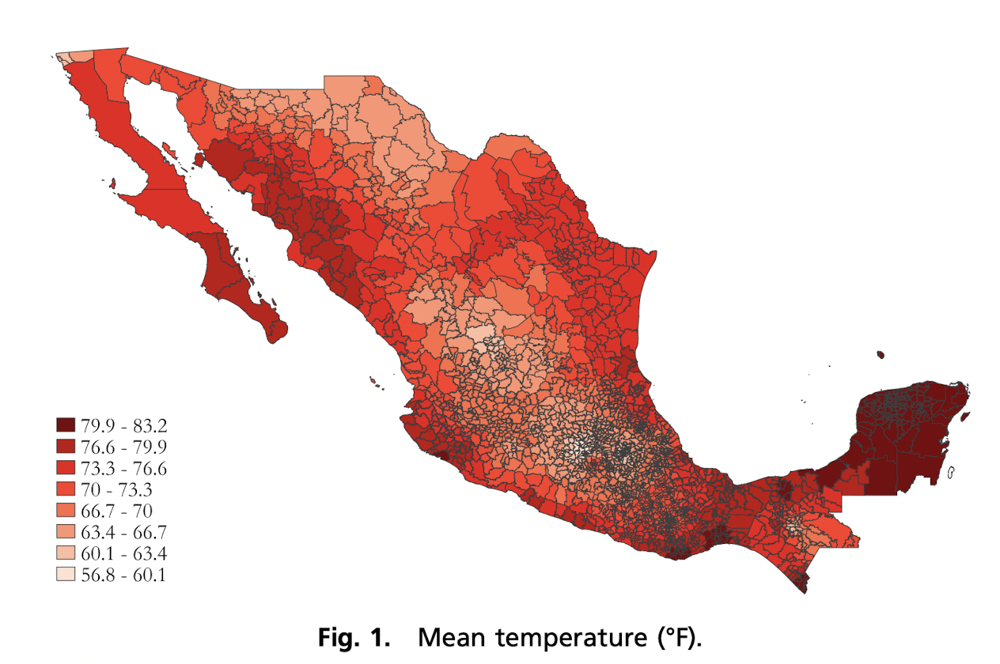
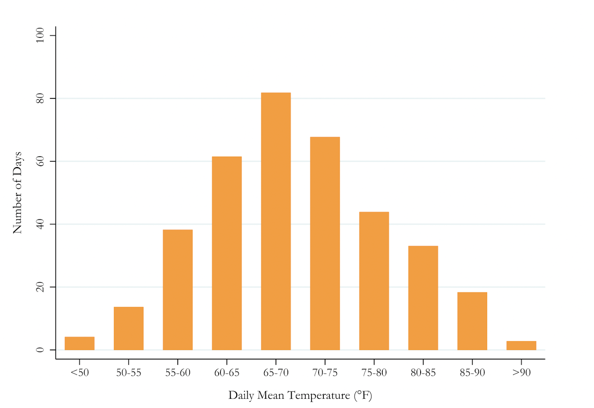
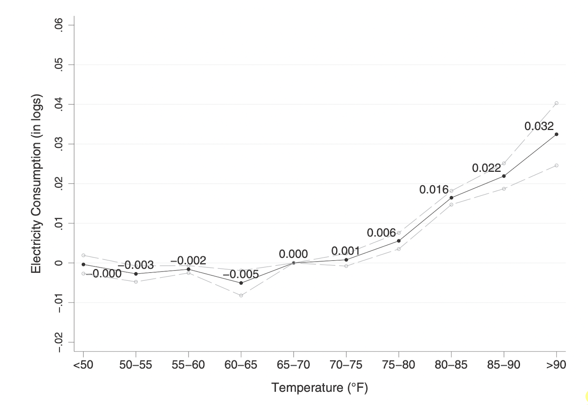
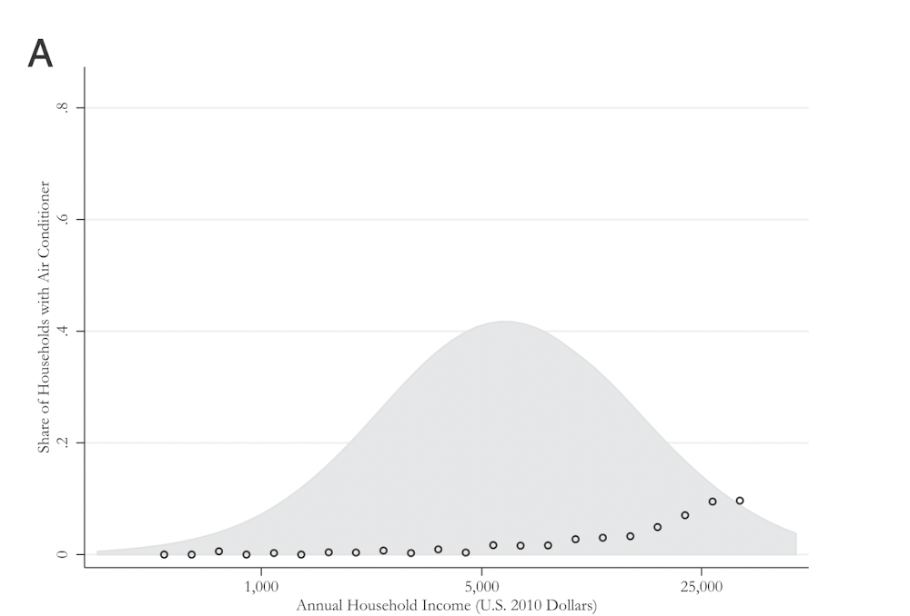
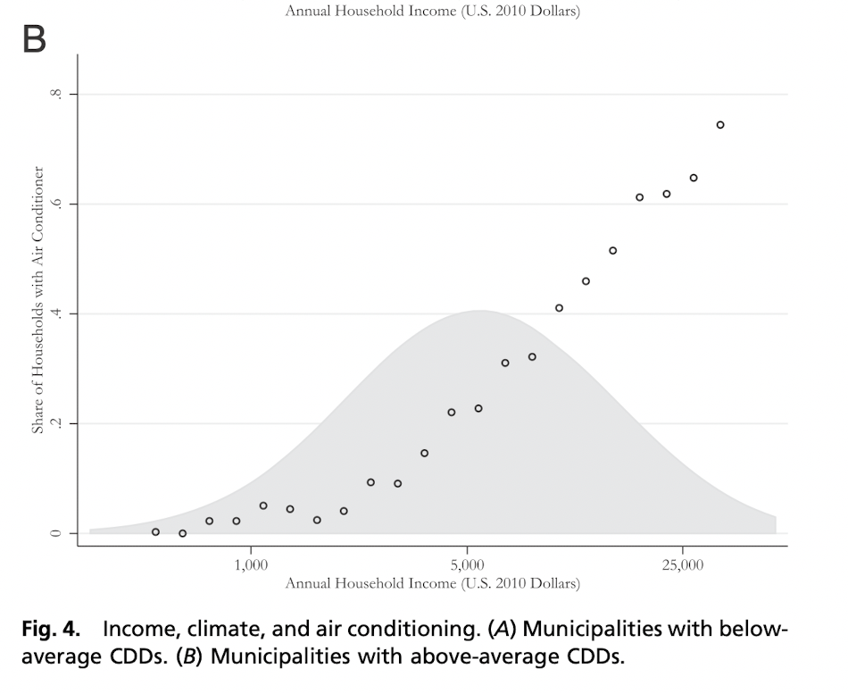
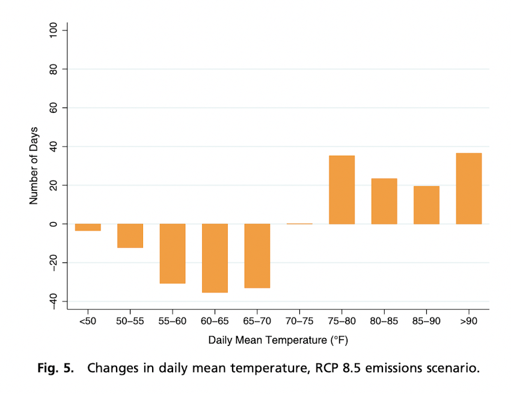
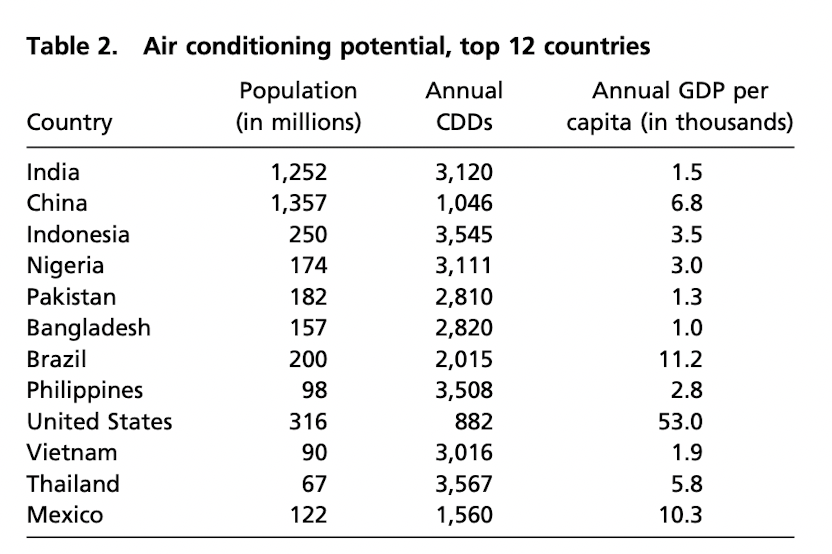

```{r setup, include=FALSE}
knitr::opts_chunk$set(echo = FALSE)
options(scipen = 999)
```

Hola amigos, esta es la plantilla para hacer pptxs en markdown (sharingan). Les dejo el resto de la presentación (que hice para micro el semestre pasado) por si quieren ver como funcionan los comandos pero a grandes rasgos:

"---"<------ indica siguiente diapositiva

"--"<------- indica espacio

".pull-left[blablalba]"<--- indica columna a la izquierda

".pull-right[blablalba]"<-- indica columna a la derecha

Todo lo demás es R markdown normalito

---
# Introduction

---
# The intensive Margin

---
# The intensive Margin



---
# The intensive Margin

---
# The intensive Margin



---
# The intensive Margin

---
# The intensive Margin



---
# The extensive Margin

---
# The extensive Margin


---
# The extensive Margin



---
# Forecasting Enf od Century Energy Use

---
# Forecasting Enf od Century Energy Use


---

# Forecasting Enf od Century Energy Use

---
# Forecasting Enf od Century Energy Use



---
# Conclusion

