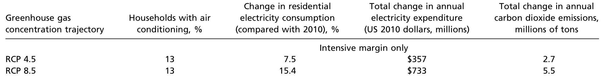
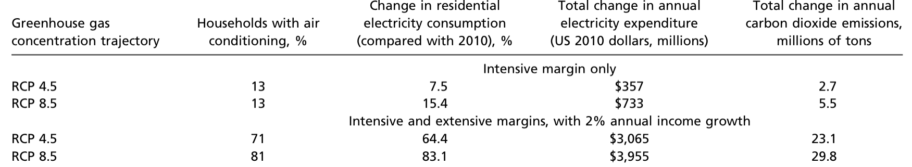

```{r setup, include=FALSE}
knitr::opts_chunk$set(echo = FALSE)
options(scipen = 999)
```

Hola amigos, esta es la plantilla para hacer pptxs en markdown (sharingan). Les dejo el resto de la presentación (que hice para micro el semestre pasado) por si quieren ver como funcionan los comandos pero a grandes rasgos:

Gracias Marco, por crear este documento...
"---"<------ indica siguiente diapositiva

"--"<------- indica espacio

".pull-left[blablalba]"<--- indica columna a la izquierda

".pull-right[blablalba]"<-- indica columna a la derecha

Todo lo demás es R markdown normalito

---
# Introduction

---
# The intensive Margin

---
# The intensive Margin


---
# The intensive Margin

---
# The intensive Margin


---
# The intensive Margin

---
# The intensive Margin


---
# The extensive Margin
Muy bonitas graficas tenia el paper, gracias autores.
---
# The extensive Margin


---
# The extensive Margin


---
# Forecasting End of Century Energy Use
En las diapositivas anteriores, mencionamos que los autores encontraron las
siguientes relaciones con respecto a la demanda de electricidad (intensivo) y
la adquisición de nuevos aparatos de enfriamiento (extensivo). Los efectos fueron:

  + Un incremento en el número de días con temperaturas altas, implica un aumento
  en la demanda de electricidad por parte de los hogares.
  
  + Un incremento en el ingreso y en el número de días calurosos incrementan
  la adopcion de tecnologías de enfriamiento por parte de los hogares. 

Utilizando los efectos estimados, los autores estiman el incremento
en la demanda por electricidad (y emisión de gases invernadero) por parte de los hogares.
---
# Forecasting End od Century Energy Use
## Predicción de Temperaturas
Los autores generaron una serie con las temperaturas para cada municipio del país al final del siglo. 
Esto se logró utilizando temperaturas actuales y sumándoles los cambios en las temperaturas de cada mes que se esperan según las predicciones encontradas en *Climate Wizard* (http://www.climatewizard.org) para dos escenarios (RCP 4.5 y 8.5). 

```{r, echo=FALSE, out.width="50%", fig.cap="Cambios en la distribución del promedio de temperaturas diarias (RCP 8.5).", fig.align="center"}
knitr::include_graphics("img/d.png")
```

---

# Forecasting End of Century Energy Use
## Predicciones del margen intensivo

Utilizando la función de respuesta de los hogares con respecto al clima/temperatura y manteniendo constante el nivel de aparatos de enfriamiento (*ceteris paribus*), los autores obtuvieron las siguientes predicciones sobre qué pasará con la demanda por energía:

```{r, echo=FALSE, out.width="95%", fig.cap="", fig.align="center"}

```

---
# Forecasting End of Century Energy Use
## Predicciones del margen intensivo + margen extensivo

Para incorporar al análisis el margen extensivo, los autores asumen un crecimiento de 2% en el producto interno bruto de México (PIB == Ingreso). El supuesto implica que el ingreso de las familias (o la economia mexicana) será 4 veces mayor dentro de 70 años. Los resultados obtenidos son los siguientes

```{r, echo=FALSE, out.width="95%", fig.cap="", fig.align="center"}

```

---
# Forecasting End of Century Energy Use

Al incorporar el efecto del uso extensivo al análisis, podemos observar que los hogares empiezan a adquirir aire acondicionado. Dado que México es un país de ingreso medio, los autores esperan que este efecto no se observe solo en México, sino que también los demás **países de ingreso medio/bajo empiecen a adquirir una mayor cantidad de equipos de enfriamiento (aires acondicionados)**. Las implicaciones del incremento en la adquisición de aires acondicionado son
  1. Un incremento en la emisión de dioxido de carbono y producción de energía.
  2. Un incremento en la inversión para incrementar la capacidad y distribución de energía electrica. 
  
Otro hecho importante a destacar es que el **efecto ingreso** es mucho más grande que el de la temperatura. 

---
# Forecasting End of Century Energy Use

```{r, echo=FALSE, out.width="95%", fig.cap="", fig.align="center"}

```
---
#Forecasting End of Century Energy Use

En la siguiente tabla se muestran  algunas características para países similares en ingreso que México.

```{r, echo=FALSE, out.width="95%", fig.cap="", fig.align="center"}
knitr::include_graphics("img/e.png")
```

---
# Conclusion

